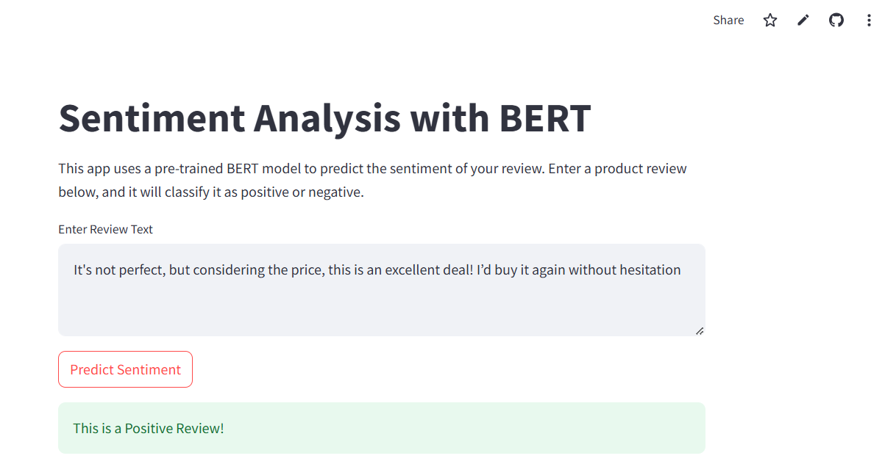

# Sentiment Analysis with BERT using Streamlit 🚀

This project demonstrates a simple web application for sentiment analysis of product reviews using a pre-trained BERT model from Hugging Face Transformers, deployed with Streamlit.

## Overview

The application allows users to input a product review and predicts its sentiment as either positive or negative. It leverages the `transformers` library for the BERT model and `streamlit` for the interactive web interface.

## Usage

1. Enter a product review in the text area. 📝
2. Click the "Predict Sentiment" button. ➡️
3. The app will classify the sentiment as either "Positive" or "Negative." 👍👎

## Snapshot

### Thank you
